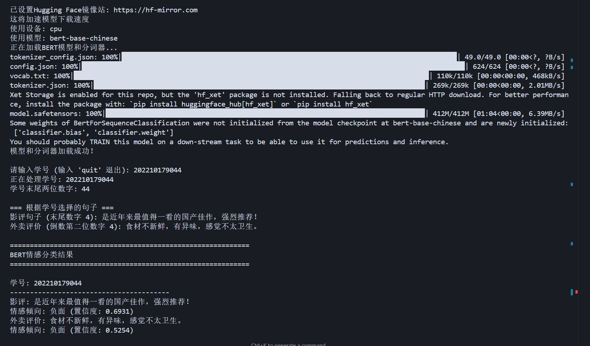
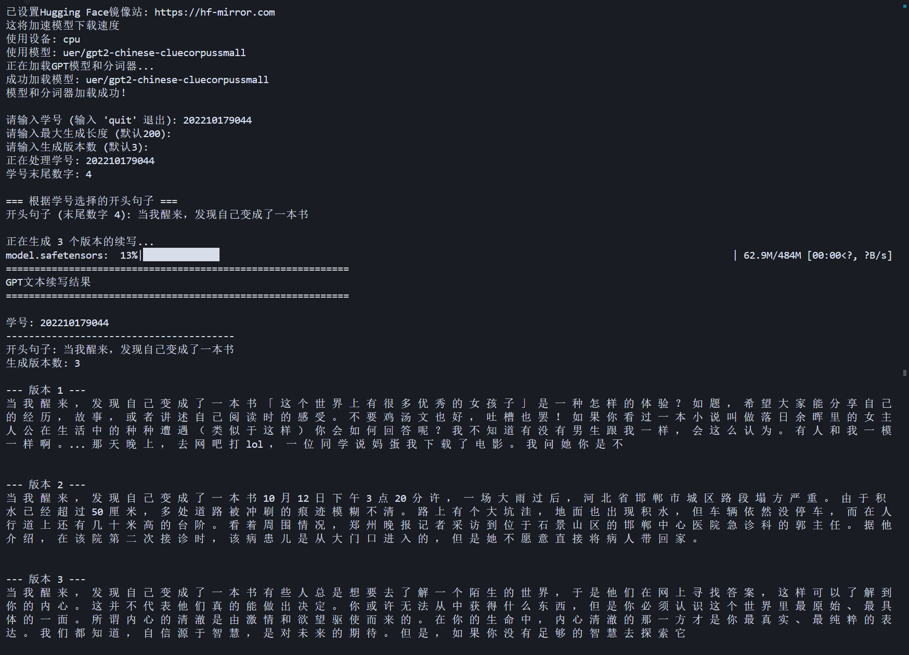

# BERT & GPT 自然语言处理任务

本项目实现了两个主要的自然语言处理任务：基于BERT的情感分类和基于GPT的文本续写。

## 项目结构

```
BERT&&GPT/
├── bert_sentiment_classifier.py    # BERT情感分类任务
├── gpt_text_generation.py         # GPT文本续写任务
├── generation_result_*.txt         # 文本生成结果文件
├── image/                          # 运行结果截图
└── README.md                       # 项目说明文档
```

## 功能特性

### 一、基于BERT的情感分类（5分）

- **模型**: 使用Hugging Face的`bert-base-chinese`中文BERT模型
- **功能**: 对影评和外卖评价进行情感倾向分类（正面/负面）
- **数据**: 根据学号末尾两位数字索引选取对应句子进行分类

#### 分类数据集

**影评数据（根据学号末尾第一位选择）:**
- 0：这部电影太精彩了，节奏紧凑毫无冷场，完全沉浸其中！
- 1：剧情设定新颖不落俗套，每个转折都让人惊喜。
- 2：导演功力深厚，镜头语言非常有张力，每一帧都值得回味。
- 3：美术、服装、布景细节丰富，完全是视觉盛宴！
- 4：是近年来最值得一看的国产佳作，强烈推荐！
- 5：剧情拖沓冗长，中途几次差点睡着。
- 6：演员表演浮夸，完全无法让人产生代入感。
- 7：剧情老套，充满套路和硬凹的感动。
- 8：对白尴尬，像是AI自动生成的剧本。
- 9：看完只觉得浪费了两个小时，再也不想看第二遍。

**外卖评价数据（根据学号末尾第二位选择）:**
- 0：食物完全凉了，吃起来像隔夜饭，体验极差。
- 1：汤汁洒得到处都是，包装太随便了。
- 2：味道非常一般，跟评论区说的完全不一样。
- 3：分量太少了，照片看着满满的，实际就几口。
- 4：食材不新鲜，有异味，感觉不太卫生。
- 5：食物份量十足，性价比超高，吃得很满足！
- 6：味道超级赞，和店里堂食一样好吃，五星好评！
- 7：这家店口味稳定，已经回购好几次了，值得信赖！
- 8：点单备注有按要求做，服务意识很棒。
- 9：包装环保、整洁美观，整体体验非常好。

### 二、基于GPT的文本续写（5分）

- **模型**: 使用Hugging Face的`uer/gpt2-chinese-cluecorpussmall`中文GPT模型
- **功能**: 根据给定的句子开头进行创意文本续写
- **数据**: 根据学号末尾第一位数字选择对应的开头句子

#### 续写开头句子（根据学号末尾第一位选择）:
- 0：如果我拥有一台时间机器
- 1：当人类第一次踏上火星
- 2：如果动物会说话，它们最想告诉人类的是
- 3：有一天，城市突然停电了
- 4：当我醒来，发现自己变成了一本书
- 5：假如我能隐身一天，我会
- 6：我走进了那扇从未打开过的门
- 7：在一个没有网络的世界里
- 8：如果世界上只剩下我一个人
- 9：梦中醒来，一切都变了模样

## 技术特点

### 🚀 核心功能
- **镜像站加速**: 自动设置Hugging Face镜像站(`https://hf-mirror.com`)
- **设备自适应**: 自动检测并使用GPU/CPU
- **批量处理**: 支持多个学号的批量处理
- **结果保存**: 自动保存分类和生成结果到文件

### 🔧 BERT情感分类特性
- 预训练模型微调
- 情感倾向分析（正面/负面）
- 置信度评估
- 详细分类报告

### ✍️ GPT文本续写特性
- 多版本生成（默认3个版本）
- 可调参数（温度、长度、采样策略）
- 重复内容过滤
- 创意文本生成

## 使用方法

### 环境要求

```bash
# 安装依赖包
pip install torch>=1.9.0
pip install transformers>=4.20.0
pip install numpy>=1.21.0
pip install scikit-learn>=1.0.0
```

### 运行BERT情感分类

```bash
python bert_sentiment_classifier.py
```

选择运行模式：
1. 演示模式：使用预设学号进行示例
2. 交互式模式：手动输入学号

### 运行GPT文本续写

```bash
python gpt_text_generation.py
```

选择运行模式：
1. 演示模式：使用预设学号进行示例
2. 交互式模式：手动输入学号和生成参数

## 运行结果

### 1. BERT情感分类结果




### 2. GPT文本续写结果


