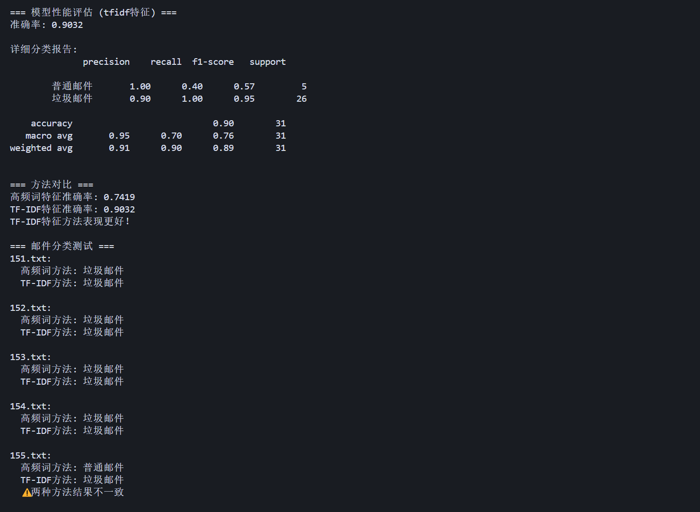
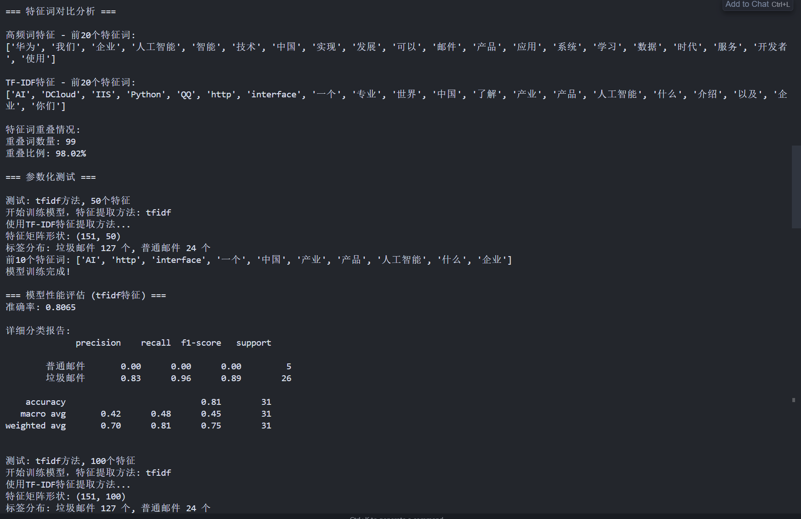

# 邮件分类器项目

基于朴素贝叶斯算法的垃圾邮件分类器，支持多种特征提取方法。

## 文件说明

- `classify.ipynb` - 基础版邮件分类器（原始实现）
- `email_classifier_optimized.py` - **优化版邮件分类器**（推荐使用）
- `邮件_files/` - 邮件数据集文件夹
  - `0.txt ~ 126.txt` - 垃圾邮件样本
  - `127.txt ~ 150.txt` - 正常邮件样本

## 主要功能

### 基础版功能
- 基于高频词的特征提取
- 朴素贝叶斯分类
- 简单的邮件分类预测

### 优化版功能 ✨
- **参数化特征选择**：支持两种特征提取方法的灵活切换
  - 高频词特征（Frequency Features）
  - TF-IDF加权特征（TF-IDF Features）
- 模型性能评估和对比
- 不同参数组合的自动测试
- 详细的分类报告和特征词分析

## 运行结果







## 性能对比

根据测试结果：

| 方法 | 特征数 | 准确率 |
|------|--------|--------|
| TF-IDF | 100 | **90.32%** ⭐ |
| TF-IDF | 200 | 87.10% |
| TF-IDF | 50 | 80.65% |
| 高频词 | 50 | 77.42% | 
| 高频词 | 100 | 74.19% |

**推荐配置**：TF-IDF方法 + 100个特征，准确率可达90.32%

## 技术特点

- 🔄 **参数化设计**：可轻松切换特征提取方法
- 📊 **性能评估**：包含详细的分类报告和准确率对比
- 🎯 **最佳实践**：使用sklearn的TfidfVectorizer和朴素贝叶斯
- 🔍 **特征分析**：支持特征词重叠度分析和对比
- ⚡ **高效实现**：优化的数据处理和模型训练流程

## 环境要求

```
jieba
numpy
scikit-learn
