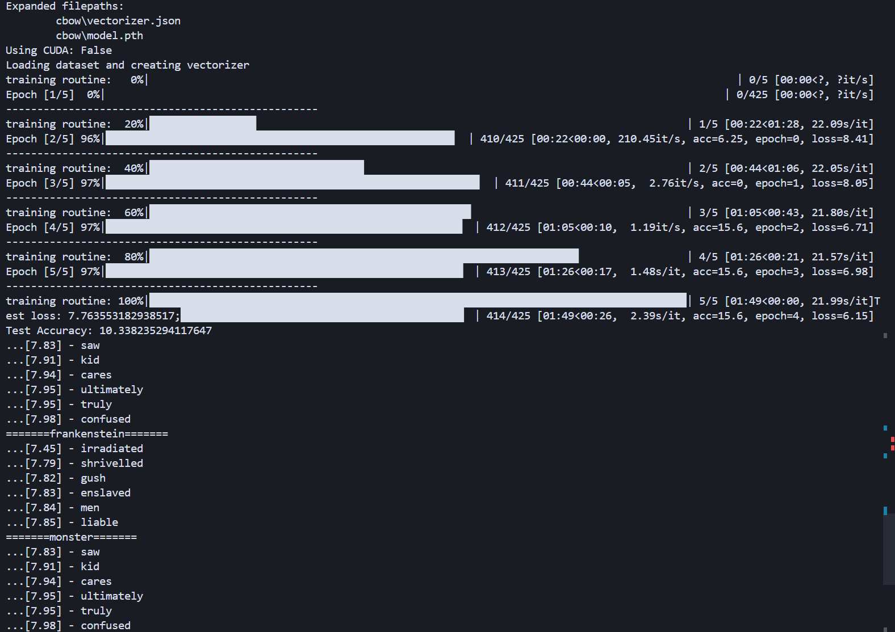
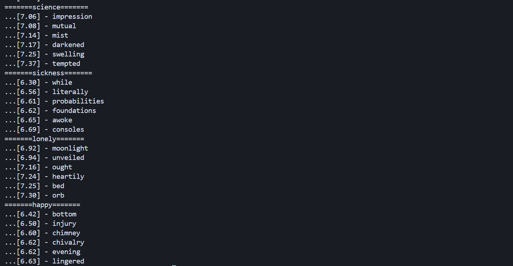

# CBOW 模型实现填空题

## Vocabulary 类

1. **在Vocabulary类中，mask_token对应的索引通过调用add_token方法赋值给self.mask_index属性。**

2. **lookup_token方法中，如果self.unk_index >=0，则对未登录词返回self.unk_index。**

3. **调用add_many方法添加多个token时，实际是通过循环调用add_token方法实现的。**

## CBOWVectorizer 类

4. **vectorize方法中，当vector_length < 0时，最终向量长度等于indices的长度。**

5. **from_dataframe方法构建词表时，会遍历DataFrame中context和target两列的内容。**

6. **out_vector[len(indices):]的部分填充为self.cbow_vocab.mask_index。**

## CBOWDataset 类

7. **_max_seq_length通过计算所有context列的str.split()后的长度的最大值得出。**

8. **set_split方法通过self._lookup_dict选择对应的indices和labels。**

9. **__getitem__返回的字典中，y_target通过查找target列的token得到。**

## 模型结构

10. **CBOWClassifier的forward中，x_embedded_sum的计算方式是embedding(x_in).sum(dim=1)。**

11. **模型输出层fc1的out_features等于embedding_dim参数的值。**

## 训练流程

12. **generate_batches函数通过PyTorch的DataLoader类实现批量加载。**

13. **训练时classifier.train()的作用是启用dropout和batch normalization模式。**

14. **反向传播前必须执行optimizer.zero_grad()清空梯度。**

15. **compute_accuracy中y_pred_indices通过argmax方法获取预测类别。**

## 训练状态管理

16. **make_train_state中early_stopping_best_val初始化为float('inf')。**

17. **update_train_state在连续args.early_stopping_criteria次验证损失未下降时会触发早停。**

18. **当验证损失下降时，early_stopping_step会被重置为0。**

## 设备与随机种子

19. **set_seed_everywhere中与CUDA相关的设置是torch.cuda.manual_seed_all(seed)。**

20. **args.device的值根据torch.cuda.is_available()确定。**

## 推理与测试

21. **get_closest函数中排除计算的目标词本身是通过continue判断word == target_word实现的。**

22. **测试集评估时一定要调用eval()方法禁用dropout。**

## 关键参数

23. **CBOWClassifier的padding_idx参数默认值为0。**

24. **args中控制词向量维度的参数是embedding_size。**

25. **学习率调整策略ReduceLROnPlateau的触发条件是验证损失增加。**

## 部署代码截图

